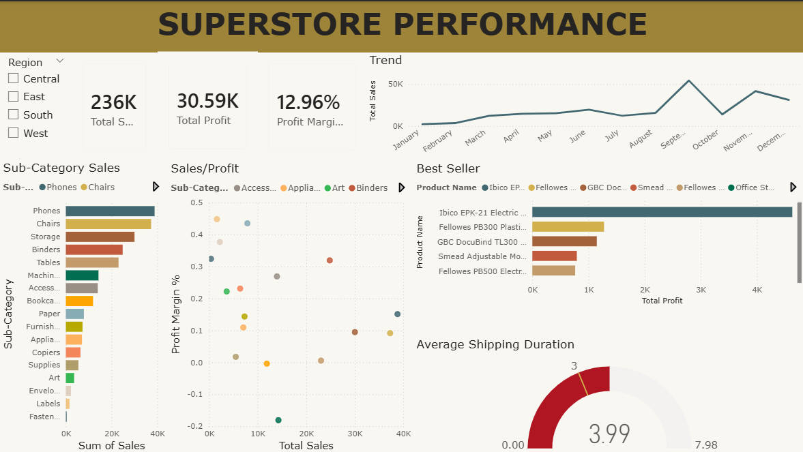

# Superstore_Analysis
Data analysis project exploring superstore performance using SQL and Power BI.

# 🛒 Superstore Sales & Operational Performance Analysis

## 📌 Project Overview
This project focuses on analyzing the retail operations and sales performance of a global Superstore. Using a combination of **SQL** for robust data transformation and **Power BI** for interactive visualization, the analysis identifies key growth drivers, regional profitability, and operational bottlenecks to support data-driven decision-making.

## 📊 Dashboard Preview

## 💡 Key Business Insights
* **Profitability Analysis:** Identified that while the 'Technology' category drives the highest revenue, 'Tables' under the Furniture category consistently generate negative margins due to high shipping costs and discounts.
* **Regional Performance:** The Western region shows the highest customer lifetime value (CLV), whereas the South region requires strategic intervention in shipping logistics to improve delivery timelines.
* **Customer Segmentation:** Successfully segmented customers into Consumer, Corporate, and Home Office tiers to identify the most loyal revenue streams and optimize promotional spend.

## 🛠️ Technical Workflow & SQL Logic
The end-to-end data pipeline is structured as follows:

### 1. Data Cleaning & Preparation
* **Data Integrity:** Handled inconsistent date formats, managed null values in postal codes, and standardized city/state naming conventions.
* **Redundancy Control:** Implemented logic to identify and remove duplicate transaction records.
* **View Script:** [1_cleaning.sql](scripts/1_cleaning.sql)

### 2. Exploratory Data Analysis (EDA)
* **Performance Metrics:** Developed SQL queries to calculate Year-over-Year (YoY) growth, Profit Margins, and Average Order Value (AOV).
* **Advanced Aggregations:** Utilized **Window Functions** to rank top-performing products within each sub-category.
* **Shipping Analysis:** Analyzed the correlation between shipping modes and delivery delays using time-series logic.
* **View Script:** [2_eda.sql](scripts/2_eda.sql)

## 🧰 Tech Stack
* **Database:** SQL (MySQL)
* **Visualization:** Power BI Desktop
* **Analysis Methodology:** Descriptive & Diagnostic Analytics
